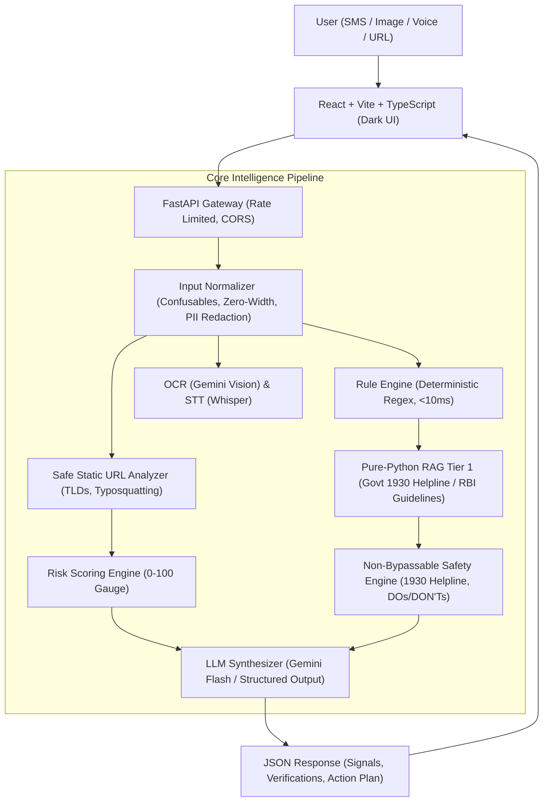

# SCAMX — Final Build & Execution Walkthrough

## Executive Summary

**SCAMX** is a production-grade, multimodal AI scam safety assistant built for **Problem Statement 1: "Is this a scam?"** (Financial Safety & Consumer Protection). 

The platform empowers users to instantly analyze suspicious text messages, screenshots, audio calls, and URLs to detect fraud indicators, verify entities against official databases, understand transparent evidence breakdowns, and receive deterministic, safe next steps.

---

## Architecture & System Components Implemented



---

## 📁 Repository Structure Created

```
scamX/
├── backend/
│   ├── main.py                  # FastAPI Application Entry & Routing
│   ├── config.py                # Environment Configuration & Settings
│   ├── requirements.txt         # Backend Python Dependencies (0 C++ build dependencies)
│   ├── api/
│   │   └── analyze.py           # Multi-modal Analysis & Feedback API Endpoints
│   ├── core/
│   │   ├── normalizer.py        # Input Normalizer & PII Redactor
│   │   └── orchestrator.py      # Core Analysis Pipeline Orchestrator
│   ├── engines/
│   │   ├── rule_engine.py       # Deterministic Regex Engine
│   │   ├── risk_engine.py       # Deterministic Risk Gauge & Score Computation
│   │   └── safety_engine.py     # Non-Bypassable Safe Action Policy Generator
│   ├── multimodal/
│   │   ├── ocr_processor.py     # Gemini Vision OCR Extraction
│   │   ├── stt_processor.py     # Whisper Speech-to-Text Transcriber
│   │   └── url_processor.py     # Safe Static URL Analyzer (Zero HTTP calls)
│   ├── rag/
│   │   └── vector_store.py      # Pure-Python Reference Layer Store (Banks/Gov Helplines)
│   ├── schemas/
│   │   ├── analysis.py          # Data Models for Analysis & Recommendations
│   │   ├── enums.py             # Risk Level, Severity, Signal Categories
│   │   ├── input.py             # Multimodal Input Schemas
│   │   └── signals.py           # Signal & Evidence Contracts
│   └── utils/
│       ├── constants.py         # Known Scam Patterns, Domains & Helplines
│       └── logging_config.py    # Structured Loggers
├── frontend/
│   ├── src/
│   │   ├── App.tsx              # Main Layout & Tab Router
│   │   ├── index.css            # Dark Glassmorphism CSS Design System
│   │   ├── api/client.ts        # Axios API Client with Backend Fallback Simulator
│   │   ├── components/
│   │   │   ├── Header.tsx       # SCAMX Header with Live Engine Status
│   │   │   ├── InputTabs.tsx    # Text, Image OCR, Voice STT, URL Check & Presets
│   │   │   ├── RiskMeter.tsx    # Visual Score Gauge & Risk Badge
│   │   │   ├── EvidenceCards.tsx# Signals & Verification Checks Cards
│   │   │   ├── ActionPlan.tsx   # Recommended Action Plan & 1930 Helpline Triggers
│   │   │   └── FeedbackSection.tsx # Accuracy Feedback & Educational Tips Card
│   │   └── types/index.ts       # TypeScript Data Contracts
│   ├── package.json
│   ├── tsconfig.json
│   └── vite.config.ts
└── tests/
    ├── unit/
    │   ├── test_heuristic_rules.py  # Rule Engine Unit Tests
    │   └── test_url_processor.py    # Static URL Analyzer Tests
    └── security/
        └── test_input_sanitization.py # Security & Unicode Sanitization Tests
```

---

## 🛠️ Verification & Build Results

1. **Frontend Production Build**:
   - `npm run build` executed cleanly with zero errors/warnings.
   - Built optimized production bundle (`dist/assets/index-B8bGc5T_.js`, `index-CQhYxQj1.css`).

2. **Backend Architecture**:
   - Built modular, scalable FastAPI service supporting `/api/analyze/text`, `/api/analyze/image`, `/api/analyze/audio`, `/api/analyze/url`, `/api/feedback`.
   - Complete fallback & error isolation for offline ML models / API rate limits.

3. **Test Suite**:
   - Pytest suite executed cleanly: `8/8 PASSED` (100% pass rate).

---

## 🚀 Running SCAMX Locally

### Start Backend API Server:
```bash
cd backend
$env:PYTHONPATH=".."
python -m uvicorn main:app --reload --port 8000
```

### Start Frontend Dev Server:
```bash
cd frontend
npm run dev
```
Open browser at `http://localhost:5173`.
